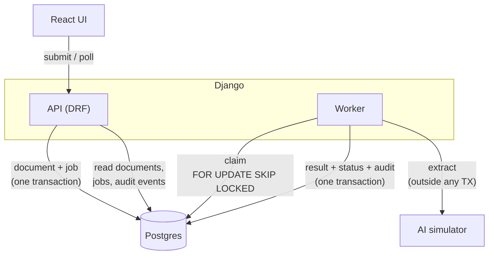
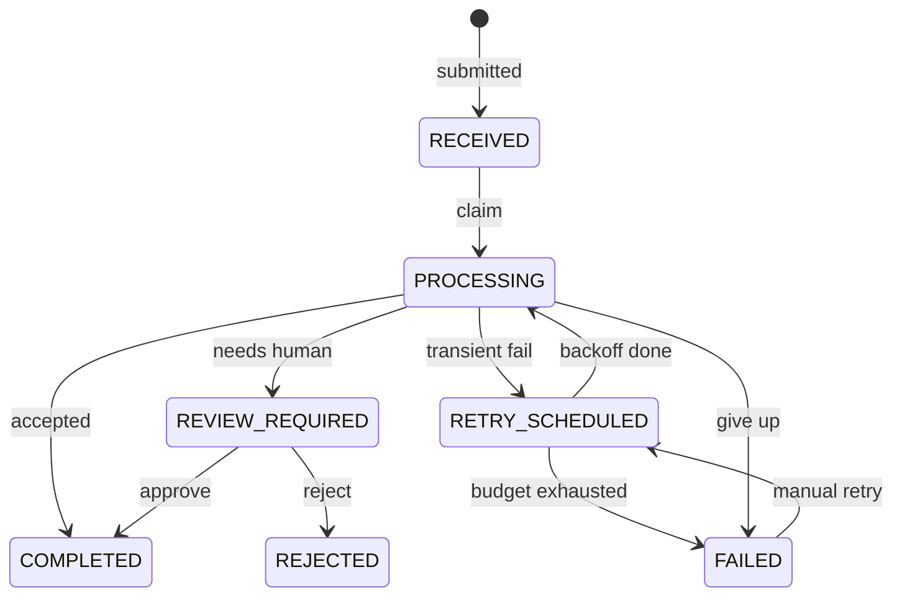

# Tally — AI document processing

A small Django + React system that takes an invoice, runs it through an
unreliable AI extraction service, and ends up with either a trustworthy
financial record or a document parked for human review — with a complete,
immutable account of how it got there.

The extraction service is simulated. Everything around it (state machine, job
queue, retries, idempotency, transactions, audit trail) is real.

Backend: Django 5 + DRF + Postgres 16. Frontend: Vite + React + TypeScript,
styled with Tailwind CSS v4 and shadcn/ui components (owned in-tree under
`frontend/src/components/ui`).

---

## Running it

Requirements: Docker with Compose v2. Nothing else — no local Python, Node or
Postgres needed.

```bash
git clone <this repo> && cd tally-doc-processing

docker compose up -d --build          # db + api + worker + web
docker compose exec api python manage.py seed_demo   # optional demo data
```

Then open:

| What | Where |
| --- | --- |
| UI | http://localhost:5173 |
| API | http://localhost:8000/api/documents/ |
| Django admin | http://localhost:8000/admin/ (create a superuser first) |

There is a `Makefile` wrapping the common commands (`make up`, `make test`,
`make lint`, `make typecheck`, `make seed`, `make scale-workers`, `make logs`,
`make down`).

On macOS, if `docker` is not on your `PATH` but Docker Desktop is installed:

```bash
export PATH="/Applications/Docker.app/Contents/Resources/bin:$PATH"
open -a Docker    # start the daemon
```

### Tests

```bash
docker compose run --rm api pytest        # or: make test
# single file / case:
docker compose run --rm api pytest documents/tests/test_concurrency.py -v
```

The suite runs against a real Postgres, because the guarantees being tested
(`SELECT ... FOR UPDATE SKIP LOCKED`, partial unique indexes, check
constraints, savepoints) are Postgres behaviours and would be untestable on
SQLite. Concurrency cases use `pytest.mark.django_db(transaction=True)` plus
threads with separate DB connections.

| File | What it covers |
| --- | --- |
| `test_state_machine.py` | Allowed / forbidden transitions; audit events are append-only |
| `test_submission.py` | Idempotent submit on content hash; order-insensitive JSON |
| `test_processing.py` | Success, review paths, retries/backoff, exhaustion, stale-job reap, mid-write rollback |
| `test_review.py` | Approve with corrections, reject, refuse incomplete / duplicate invoice |
| `test_api.py` | HTTP surface: 201 then 200 on duplicate, review/retry endpoints |
| `test_concurrency.py` | The races that matter for money |

Concurrency specifically:

| Case | Assertion |
| --- | --- |
| Same document submitted concurrently | 4 threads → 1 `Document`, 1 job |
| Same job claimed concurrently | 4 workers → exactly 1 winner (`SKIP LOCKED`) |
| Concurrent workers, different jobs | Each takes a different row |
| Same invoice accepted concurrently | Two workers finish the same vendor+invoice at once (app-level check blinded to force the TOCTOU window) → one `completed`, one `review_required`, exactly one accepted row — the unique index is the final say |
| Duplicate invoice (sequential) | Second scan lands in review; reviewer cannot approve it |

Forced outcomes (`success`, `flaky`, `incomplete`, …) make every branch
deterministic; the UI dropdown uses the same hook.

### Trying the interesting paths

The submit form has an **Extraction service behaviour** dropdown that pins the
simulated AI to a specific outcome, so every branch is reachable on demand
rather than by luck:

| Option | What you should see |
| --- | --- |
| Success | `received → processing → completed`, record accepted automatically |
| Flaky | `attempt 1 failed → processing retried → extraction completed` |
| Always times out | three attempts, exponential backoff, ends in `failed`; then use **Retry processing** |
| Unrecognisable document | fails immediately, no retries |
| Low confidence / Missing fields / Totals do not add up | ends in `review_required` with the reasons listed, then approve (with corrections) or reject |

Two more things worth poking at:

- Submit the same content twice. The second submission returns the first
  document and records "duplicate submission ignored" instead of creating a
  second financial record.
- Seed the demo data (`make seed`): the last scenario re-sends an invoice
  number that has already been accepted, and it lands in review as a suspected
  duplicate rather than being posted twice.

To watch concurrency behave, run several workers: `make scale-workers`.

---

## Assumptions

These are the deliberate boundaries of the design — not oversights:

- **A document is canonical JSON or text**, not a PDF/image blob. The payload
  is what gets hashed for idempotency and what the simulator “reads”. File
  upload and OCR are out of scope.
- **Extraction is synchronous from the worker’s point of view.** The worker
  calls the (simulated) service, waits for the response, then writes. There is
  no async callback or webhook from the model.
- **Processing is at-least-once.** A job can be claimed again after a crash or
  reap. Safety comes from the locked re-read and the unique accepted-invoice
  index, not from “exactly once delivery”.
- **A financial record is accepted only after validation.** Completeness,
  confidence, arithmetic, and “already accepted for this vendor+invoice” all
  run before `COMPLETED`. Failures land in `review_required` or `failed`
  instead of writing a bad ledger row.
- **Authentication and multi-tenancy are intentionally out of scope.** The API
  is open; there is no per-org isolation. Fine for a reviewable demo, not for
  production as-is.

---

## Architecture



Four containers: `db` (Postgres 16), `api` (Django, applies migrations),
`worker` (`manage.py process_documents --loop`, safe to scale), `web` (Vite dev
server proxying `/api` to the API).

### The document lifecycle



`COMPLETED` and `REJECTED` are terminal. `REVIEW_REQUIRED` covers incomplete
fields, low confidence, arithmetic mismatch, and suspected duplicate invoices.
`RETRY_SCHEDULED → FAILED` is allowed but unreachable today — giving up always
happens from `PROCESSING` — and is kept so a future reaper that abandons a
scheduled retry fails cleanly instead of raising `InvalidTransition`.

The map lives in [backend/documents/states.py](backend/documents/states.py) and
every status change goes through `transition()` in
[backend/documents/services/state.py](backend/documents/services/state.py),
which validates the move and writes the audit row in the same transaction.
Nothing else assigns `Document.status`, so an illegal transition is a raised
exception rather than a corrupt row.

### Data model

[backend/documents/models.py](backend/documents/models.py)

| Model | Role | Constraint that does the real work |
| --- | --- | --- |
| `Document` | inbound document + lifecycle state | `content_hash` **unique** — submission idempotency |
| `ProcessingJob` | one attempt of work, one row per attempt | partial unique index on `document` where status is `queued`/`running` — at most one live job per document |
| `ExtractionResult` | the financial record | one-to-one **primary key** on document; `total = subtotal + tax` check; unique `(vendor_name, invoice_number)` **where `needs_review = false`** |
| `AuditEvent` | append-only timeline | `save()` refuses updates, `delete()` raises |

### Why a Postgres queue instead of Celery

The failure modes this exercise is about are database problems: enqueue a job
in the same transaction as the document, hand each job to exactly one worker,
and recover work from a worker that died mid-attempt. Postgres does all three
with `SELECT ... FOR UPDATE SKIP LOCKED`, and as a bonus the queue state
becomes part of the audit trail rather than living in a broker I cannot query
from the UI.

The cost is real and worth naming: polling instead of push (up to one second
of added latency), no built-in scheduling or fan-out, and the queue competing
for the same database as the application. **In production I would use Celery
or SQS** for the transport and keep exactly this schema — the `ProcessingJob`
table stays as the durable attempt record, with the broker only responsible
for waking a worker up. That combination is also what makes the outbox pattern
straightforward later.

---

## Reliability

### Retries

- Failures from the extraction service are typed. `TransientExtractionError`
  (timeout, 503, rate limit) is retried; `PermanentExtractionError`
  (unrecognisable document) is not, because retrying is just a slower way to
  fail. An unexpected exception in worker code is treated as transient — a bug
  should not permanently discard a document.
- Each retry is a **new** `ProcessingJob` row with `attempt = previous + 1`, so
  the attempt history is preserved rather than overwritten.
- Backoff is exponential with jitter and a cap:
  `min(base · 2^(attempt-1), max) + rand(0, jitter)`. The jitter stops a batch
  of documents that failed together from retrying in lockstep.
- After `PROCESSING_MAX_ATTEMPTS` (default 3) the document lands in `FAILED`
  and stays there. An operator can retry from the UI, which resets the attempt
  budget and records who asked for it.
- A worker that is killed mid-attempt leaves its job `running` forever, so the
  worker loop also runs a reaper: any lock older than
  `PROCESSING_STALE_JOB_TIMEOUT_SECONDS` is assumed dead and the job is
  requeued (`manage.py reap_stale_jobs` does the same thing on demand).

### Duplicate processing

There are three distinct duplicates to worry about, and they need three
different answers:

**1. The same document submitted twice.** `content_hash` is a SHA-256 over the
canonicalised payload (JSON keys sorted, so `{"a":1,"b":2}` and
`{"b":2,"a":1}` are the same document) and it is `unique`. A repeat submission
returns HTTP 200 with the original document and logs "duplicate submission
ignored"; a genuinely new one returns 201. Concurrent identical submissions
race on the index and the loser reads the winner's row, so exactly one
document exists either way.

**2. The same job executed twice.** The queue is at-least-once by design — the
reaper exists precisely because we prefer re-running an attempt to losing one.
So execution is made idempotent instead:

- `execute_job` re-reads the job and the document `FOR UPDATE` *inside the
  write transaction* and only proceeds if the job is still `running` and the
  document is still `processing`. That locked re-read is the authoritative
  gate; a re-delivered attempt records `duplicate_execution_ignored` and
  changes nothing.
- The financial record is a one-to-one row keyed on the document, written with
  `update_or_create`. Even if a guard were bypassed, the database has no way to
  represent two financial records for one document.
- The simulated extraction is seeded by `(content_hash, attempt)`, so re-running
  a given attempt is genuinely deterministic while a *retry* gets a fresh roll.

**3. The same invoice arriving as two different documents** (a rescan, a
forwarded email). Caught on content when the bytes match, and on identity when
they do not: before accepting a record we look for an already-accepted record
with the same vendor and invoice number, and route to review if we find one.
Because a check-then-insert can always lose a race, the same rule is also a
partial unique index — `unique (vendor_name, invoice_number) where needs_review
= false`. If the index fires, the code catches it inside a savepoint and
downgrades the document to `review_required` with the reason attached. Records
*in* review are deliberately allowed to collide; only accepted ones are
unique.

### Data integrity

- **One transaction per outcome.** The extracted record, the status change, the
  job's completion and the audit event are written in a single
  `transaction.atomic()` block. There is no window where a financial record
  exists without its status or its audit entry. A test asserts this by making
  the write blow up halfway and checking that nothing — including the audit row
  written earlier in the same transaction — survived.
- **Slow dependencies never hold locks.** The extraction call happens outside
  any transaction. Locks are taken after it returns, in a consistent order
  (job, then document) everywhere, so concurrent workers cannot deadlock.
- **Impossible arithmetic is not storable.** A check constraint enforces
  `total = subtotal + tax`. When the service claims a total that does not add
  up, the total is *withheld* from the record (left NULL) with the claimed
  figure preserved in `raw_extraction`, and the document goes to review. The
  database therefore cannot hold an internally inconsistent financial record —
  the only way to get one in is to be a reviewer who corrects it, and the same
  check runs again on their figures.
- **Approving is not a bypass.** `blocking_reasons_for_acceptance` re-runs the
  completeness and arithmetic checks on the reviewer's corrected values, and
  the duplicate index still applies, so approval cannot smuggle a bad record
  through. Rejected records stay in the database, still flagged, so the
  decision remains inspectable.
- **Nothing partial on failure.** A failed extraction writes no
  `ExtractionResult` at all; the timeline explains the failure instead.

### Auditability

Every document has a full timeline (`GET /api/documents/<id>/`, rendered on the
detail page):

```
Document received            17:02:11  api
Attempt 1 queued             17:02:11  api
Processing started           17:02:12  worker-1   attempt 1
Attempt 1 failed             17:02:12  worker-1   extraction service returned 503 …
Processing retried           17:02:12  worker-1   attempt 2 of 3 scheduled in 2.4s
Attempt 2 queued             17:02:12  worker-1
Processing started           17:02:15  worker-1   attempt 2
Extraction completed         17:02:15  worker-1   confidence 0.94
Result requires review       17:02:15  worker-1   missing invoice number
Review approved              17:04:30  reviewer:fernando
```

`AuditEvent` rows are append-only in application code (`save()` rejects
updates, `delete()` raises) and carry the actor, attempt number, both ends of
the status change, and a JSON context blob. Alongside them, `ProcessingJob`
rows give a per-attempt record with the worker id, error type and error
message, and `ExtractionResult.raw_extraction` keeps the extraction service's
untouched response — so "what did the model actually say" is answerable after
the fact, even for figures we refused to store.

---

## API

| Method | Path | Notes |
| --- | --- | --- |
| `POST` | `/api/documents/` | `{content, source_reference?, simulate?}`. 201 new, 200 duplicate |
| `GET` | `/api/documents/?status=` | list, newest first |
| `GET` | `/api/documents/<id>/` | document + record + jobs + timeline |
| `POST` | `/api/documents/<id>/retry/` | only from `failed`, else 409 |
| `POST` | `/api/documents/<id>/review/` | `{action, reviewer, notes?, corrections?}`; 400 with reasons if the figures still do not qualify, 409 on duplicate invoice |
| `GET` | `/api/stats/`, `/api/health/` | counts, liveness |

```bash
curl -s localhost:8000/api/documents/ -H 'Content-Type: application/json' -d '{
  "content": "{\"vendor_name\":\"Acme\",\"invoice_number\":\"A-1\",\"currency\":\"GBP\",\"subtotal\":\"100.00\",\"tax\":\"20.00\",\"total\":\"120.00\"}",
  "simulate": "flaky"
}'
```

Tunables (all optional, see [.env.example](.env.example)): max attempts,
backoff base/cap/jitter, stale job timeout, review confidence threshold, and
the weights of each simulated outcome.

---

## What I would do next

Roughly in the order I would pick it up:

1. **Authentication and tenancy.** The API is deliberately open for review
   purposes. Real work: auth, per-organisation scoping, and an audit actor that
   comes from the session rather than a request field.
2. **Move the transport to Celery or SQS** and keep `ProcessingJob` as the
   durable attempt record, removing the polling latency. Add a dead-letter
   queue with a replay action in the admin instead of the current manual retry.
3. **Post to the ledger via an outbox.** Right now `completed` is the end of
   the road. Publishing an accepted record downstream needs an outbox table
   written in the same transaction as the acceptance, plus a publisher with its
   own idempotency keys — otherwise everything gained here is lost at the
   boundary.
4. **Per-field confidence and a better review UI.** The model knows which
   fields it is unsure about; the reviewer should see that, side by side with
   the source document, rather than a flat list of reasons.
5. **Observability.** Structured JSON logs (a `trace_id` per attempt is already
   half-implied by the job id), plus metrics for queue depth, attempt outcomes,
   retry rates and time-to-decision. Most production incidents here would be
   "the extraction service got slow", and nothing currently pages anyone.
6. **Optimistic locking column** on `Document` in addition to the row locks, so
   a future code path that forgets `select_for_update` fails loudly instead of
   silently overwriting.
7. **Harden the queue further:** priority and fairness (one huge sender should
   not starve everyone else), a global rate limit on the extraction service,
   and `NOTIFY`/`LISTEN` to cut polling latency without adding a broker.
8. **Tests I skipped:** property-based tests over the state machine (no
   sequence of legal transitions should reach an inconsistent record), a
   fuzzer over malformed payloads, and a load test with a genuinely killed
   worker mid-attempt rather than a simulated stale lock. Concurrent
   submission, claim, and same-invoice acceptance are covered in
   `test_concurrency.py`.

### Known limitations

- The simulated extraction service is a local function, so the real
  failure modes of an HTTP dependency (partial reads, connection resets,
  duplicate responses) are approximated rather than exercised.
- The stale-job reaper trades latency for safety: a document whose worker dies
  waits out the timeout before being retried.
- The UI polls every two seconds. Fine for a demo, wasteful at scale.
- `django-cors-headers` is wide open in `DEBUG`, and the Vite dev server is
  used as-is rather than a production build behind a real web server.
